# 💄 Maquiadoro
## 💻 Projeto: Site de Vendas de Maquiagem
## 1º Semestre - Engenharia de Software - PUC Minas
### Aluna: Aléxia Fernanda Alves de Andrade

Este projeto foi desenvolvido como parte da disciplina Desenvolvimento de Interfaces Web.
O objetivo é criar um site de e-commerce voltado para a venda de produtos de maquiagem, aplicando conceitos de HTML, CSS, JavaScript, API REST e boas práticas de design de interfaces.

O site busca oferecer uma experiência de navegação moderna e intuitiva, com foco na usabilidade e estética visual, permitindo que o usuário explore, visualize e adicione produtos ao carrinho de forma simples e agradável.

## 🚀 Como Executar o Projeto

### Instale as dependências:
No terminal, na raiz do projeto:
- npm install
### Inicie o servidor (Back-end + Front-end):
- npm start
Acesse no navegador: http://localhost:3000

## 👥 Credenciais para Teste
Usuário: admin
Senha: 12345

Usuário: user
Senha: 12345
(Também é possível cadastrar novos usuários na tela de login)

## 📸 Evidências de Funcionamento (Prints)
Abaixo estão os prints que comprovam o funcionamento das funcionalidades solicitadas no escopo.

## 0. Tela Inicial e Navegação
Visualização da Home Page, Carrossel e listagem de produtos.

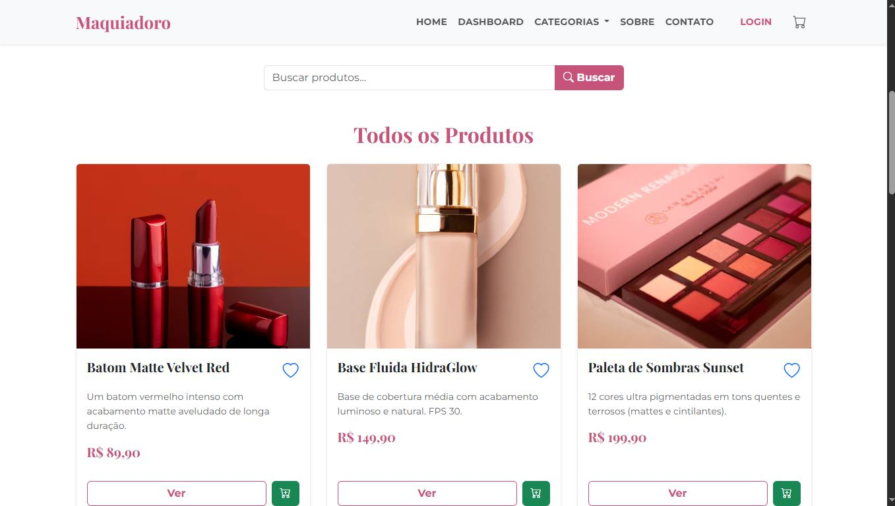
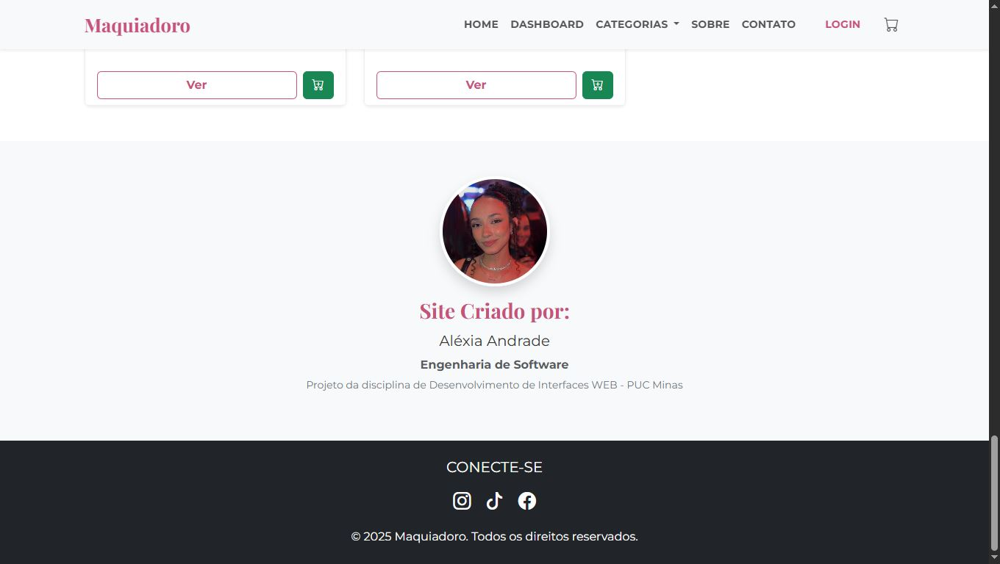

### Login e Cadastro:
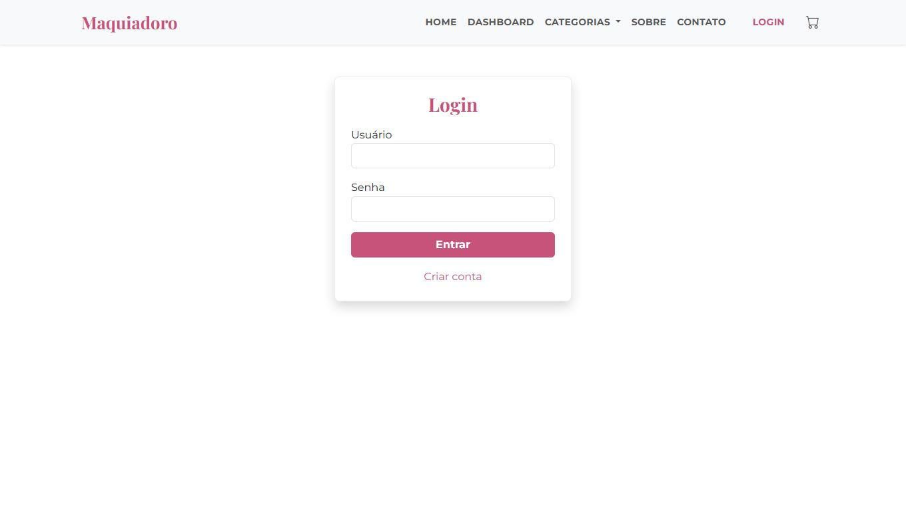
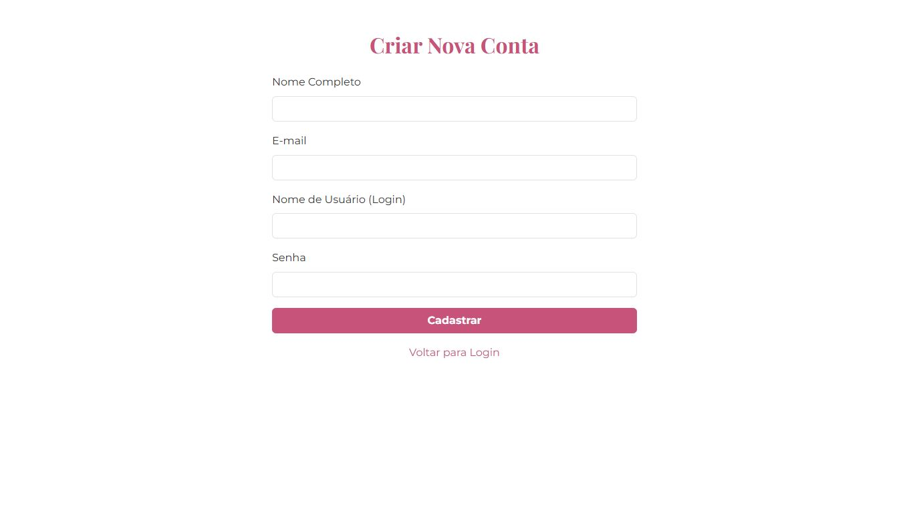

### Filtro:
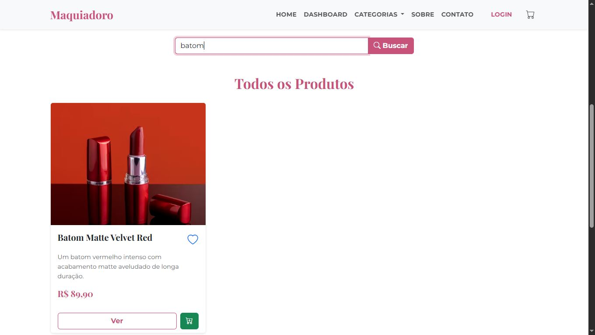

## 1. Fluxo do Administrador (CRUD e Gestão)

O usuário logado como Admin tem acesso exclusivo ao menu "Gerenciar Produtos" e visualiza botões de edição/exclusão na tela de detalhes.

### - Login:
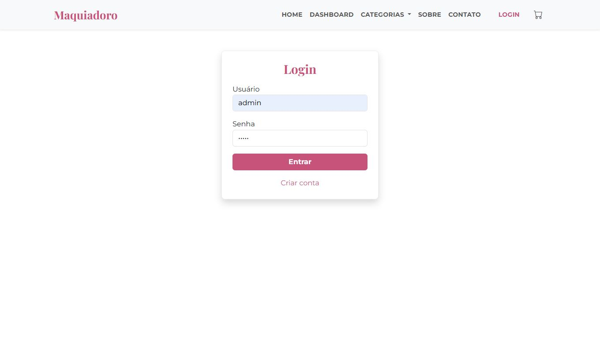

### - Adm logado:
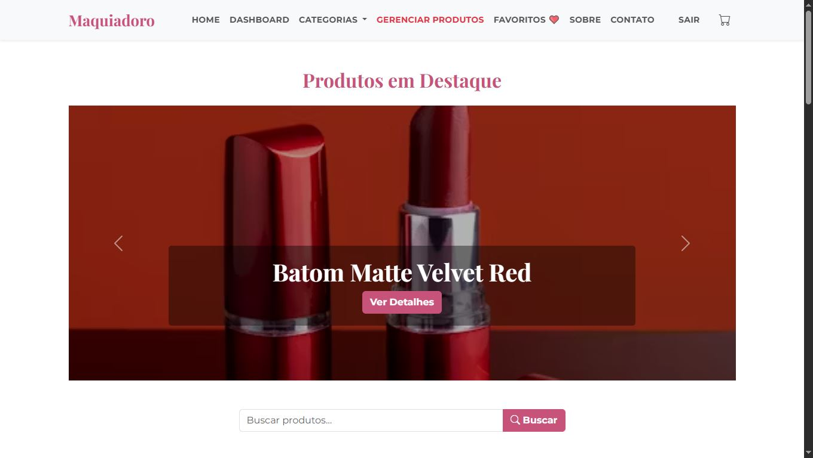

### - Cadastrar produto:
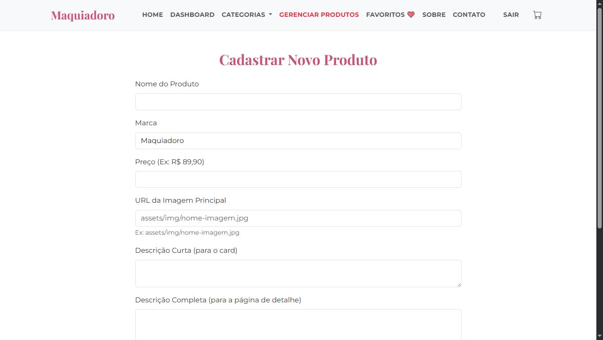

### - Editar produto:
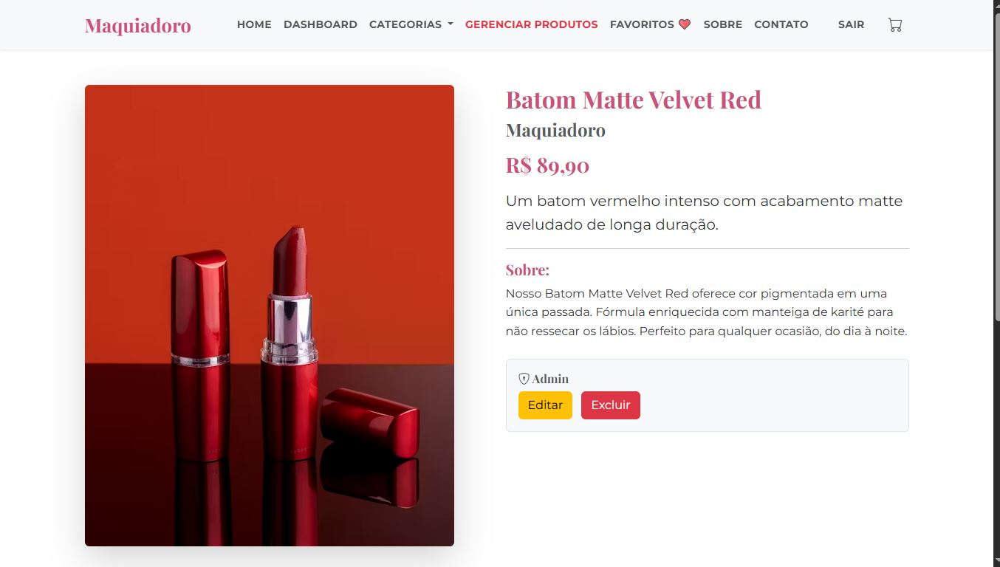

## 2. Fluxo do Cliente (Favoritos)

O usuário Cliente pode marcar produtos como favoritos. A lista é salva no servidor (db.json) e persiste entre sessões.

### - Login:

### - Usuário logado:

### - Detalhes do produto:
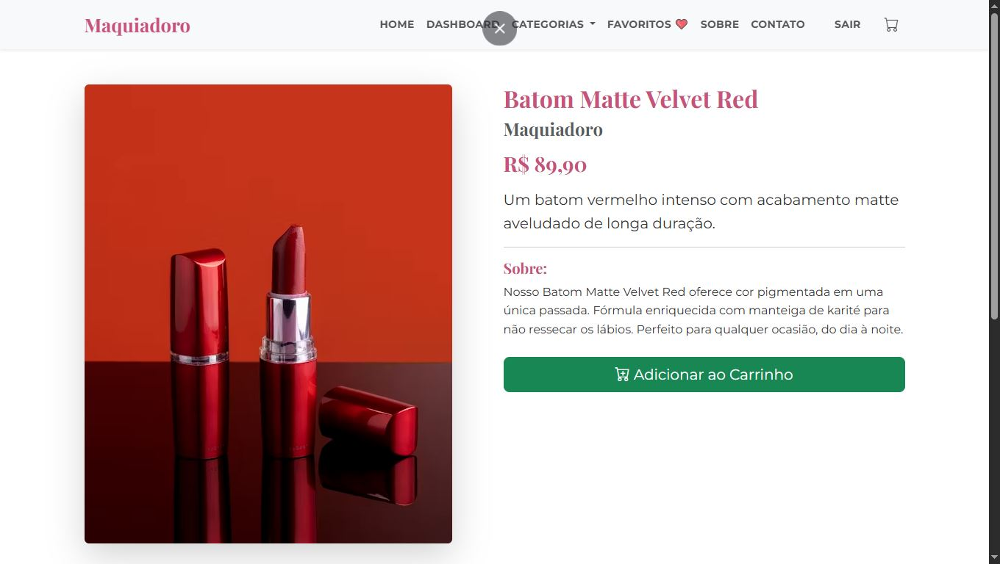

### - Favoritos:
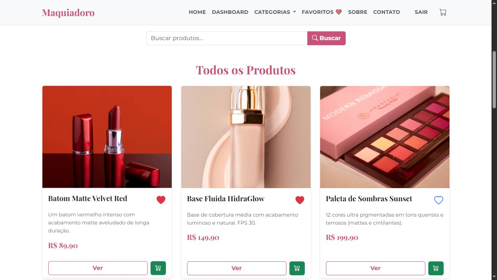
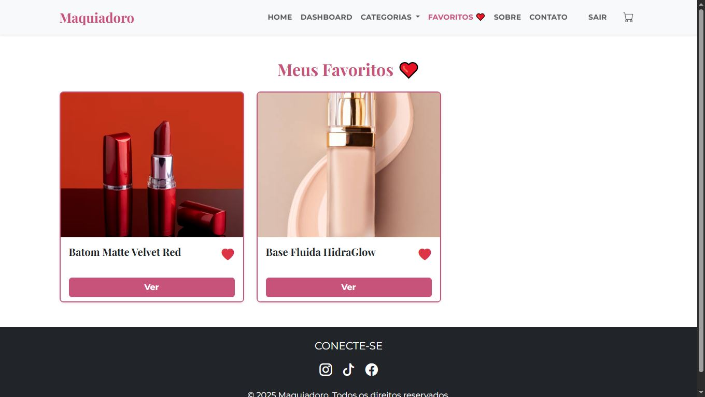

## 3. Fluxo de Compra (Carrinho)

Qualquer usuário pode adicionar produtos ao carrinho. A lista é salva no navegador (localStorage), permitindo que a compra continue mesmo se a página for fechada.

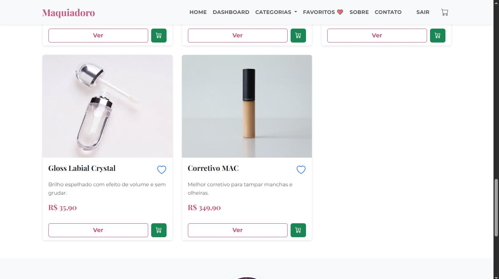
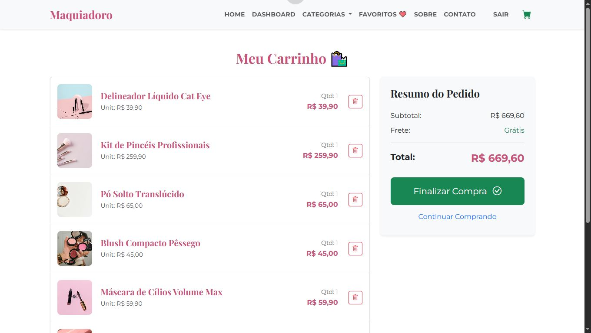

## 4. Visualização Avançada (Dashboard)

Página analítica que consome a API de produtos e gera um gráfico dinâmico comparativo de preços utilizando a biblioteca Chart.js.

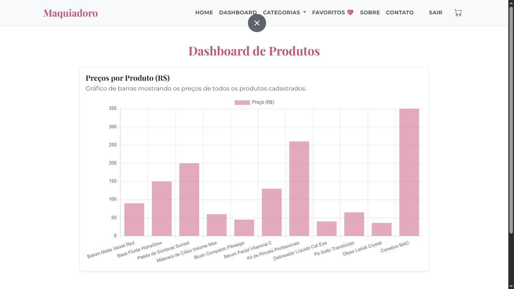

## 🛠️ Tecnologias e Funcionalidades

Front-End: HTML5, CSS3, Bootstrap 5, JavaScript (ES6+).
Back-End Simulado: JSON Server (API REST na porta 3000).
Persistência de Dados:
db.json: Produtos e Usuários (com favoritos).
localStorage: Carrinho de compras.
sessionStorage: Sessão do usuário logado.
Bibliotecas Externas:
Chart.js: Para geração de gráficos.
Bootstrap Icons: Para ícones de interface.

